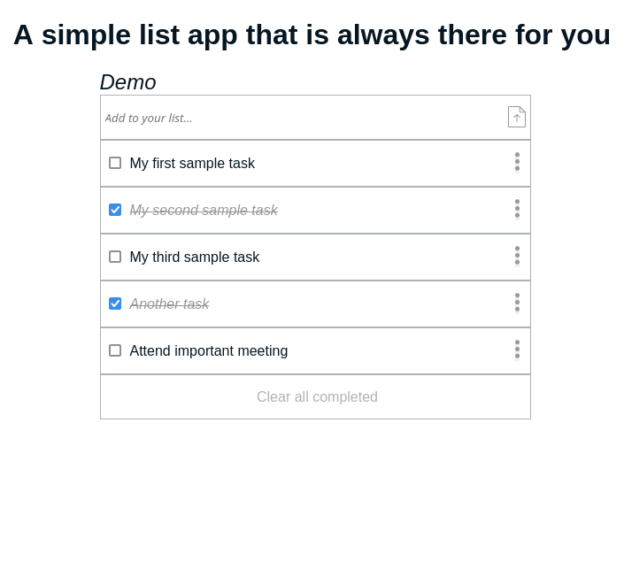

<p align="center">
  <a href="https://www.microverse.org/">
    
  </a>
  <a href="https://github.com/enionsouza/TODO-List/blob/develop/LICENSE">
    
  </a>
  <a href="https://github.com/enionsouza/TODO-List">
    
  </a>
  <a href="https://github.com/enionsouza/TODO-List">
    
  </a>
</p>

# A Simple To-Do List

<p align="center">
    
</p>

## Live Demo

A live version of this project can be found on [this link](https://enionsouza.github.io/TODO-List/dist/index.html) or on [this alternative link](https://raw.githack.com/enionsouza/TODO-List/develop/dist/index.html).

## Built With

- HTML, CSS, JavaScript, & Webpack;
- Visual Studio, Git, & GitHub;

## Getting Started

### Prerequisites

For this project, the following environment should be previously installed on your machine:

- Node 14.17.0
- Git

### Setup

In your terminal, in the folder of your preference, type the following bash command to clone this repository:

```sh
git clone git@github.com:enionsouza/TODO-List.git
```
### Install

Now that you have already cloned the repo run the following commands to get the project up and running:
```sh
cd TODO-List
npm install
npm start
```
### Executing

Now, you can start editing this template from the files provided in the `/src` folder. All the changes will be automatically updated on your local server on http://localhost:8080/. You can stop your local server at any time hitting `<Ctrl> + C` on your keyboard.

### Alternative

As an alternative to the steps mentioned above, you can simply go the the `/dist` folder and open `index.html`, on the browser of your preference.

### Tests

We have implemented tests for addTask() and deleteTask() methods in `./src/spec/todo.test.js`. You can run them using the following command:

```sh
npm test
```

Additionally, you can run `npm run watch-test` to watch any new test modification as you save them.

## Authors

👤 **Ênio Neves de Souza**

- GitHub: [@enionsouza](https://github.com/enionsouza)
- Twitter: [@enionsouza](https://twitter.com/enionsouza)
- LinkedIn: [Enio Neves de Souza](https://www.linkedin.com/in/enio-neves-de-souza/)

👤 **KARANGWA Ntwali Josue**

- GitHub: [@githubhandle](https://github.com/Ntwali-Josue)
- Twitter: [@twitterhandle](https://twitter.com/JosueNtwali)
- LinkedIn: [LinkedIn](https://linkedin.com/in/karangwa)

## 🤝 Contributing

Contributions, issues, and feature requests are welcome!

Feel free to check the [issues page](https://github.com/enionsouza/TODO-List/issues).

## Show your support

Give a ⭐️ if you like this project!

## 📝 License

This project is [MIT](./LICENSE) licensed.
